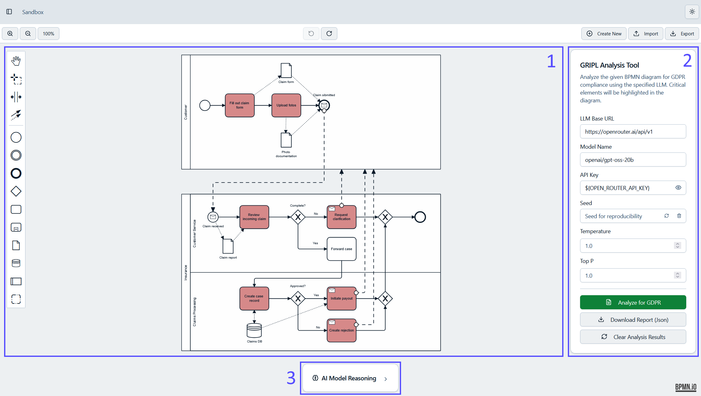
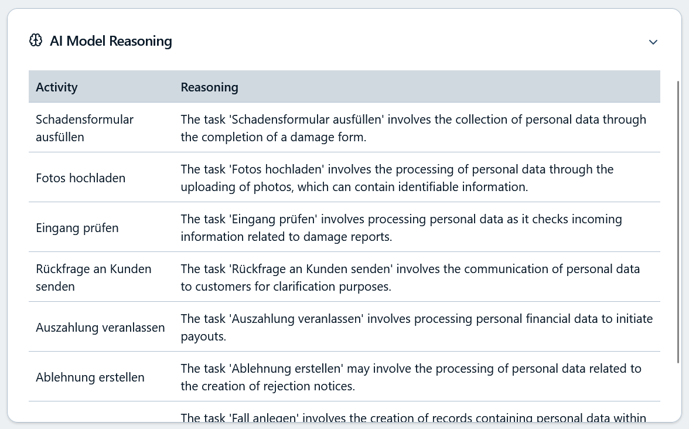
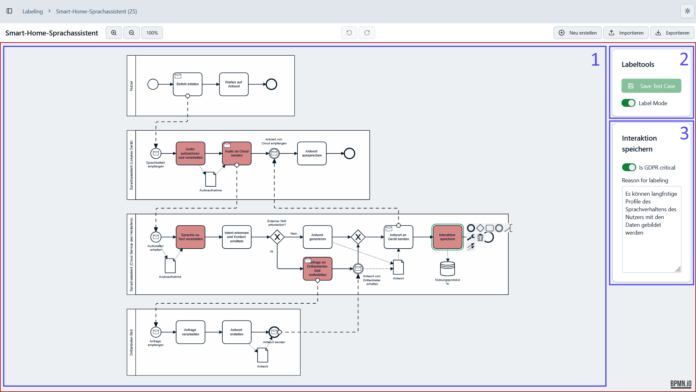
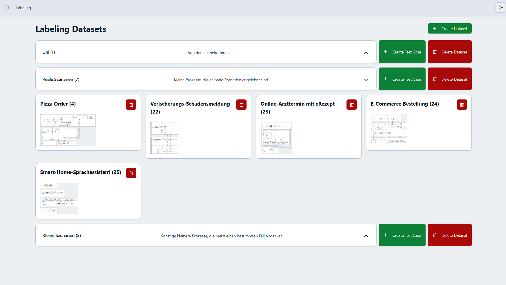
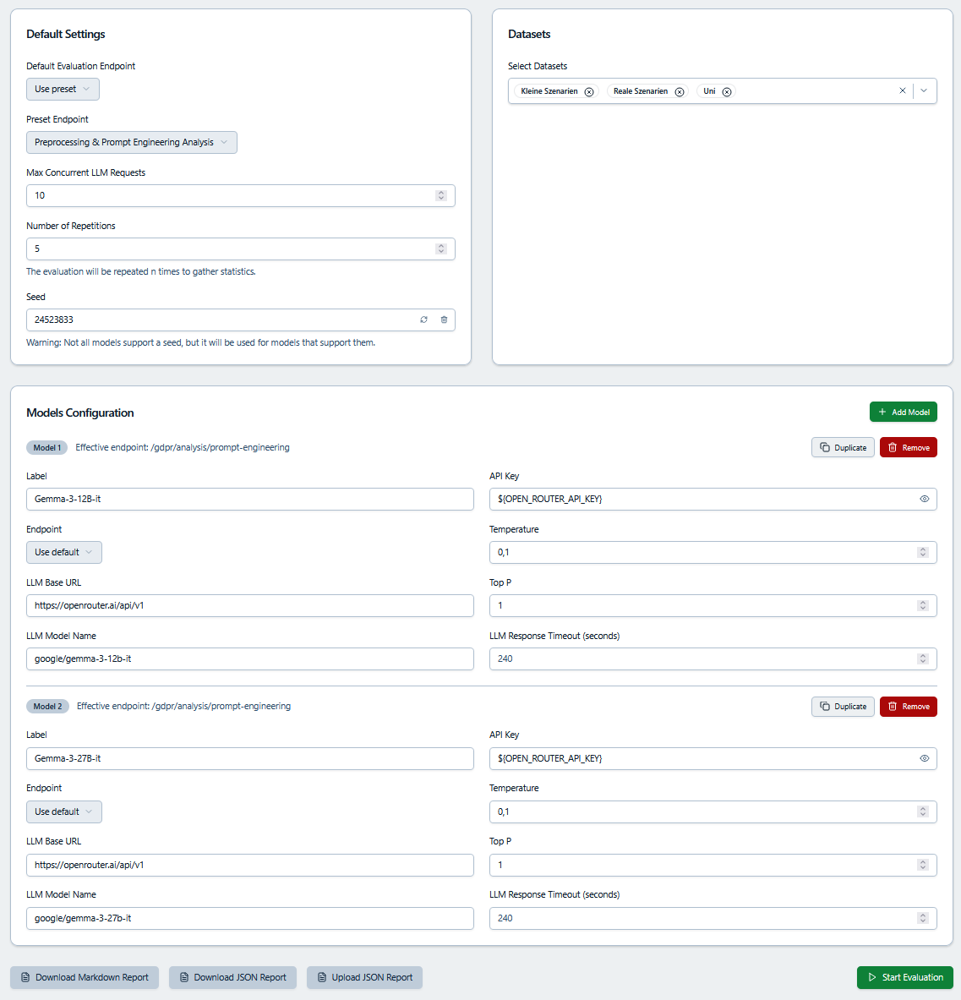
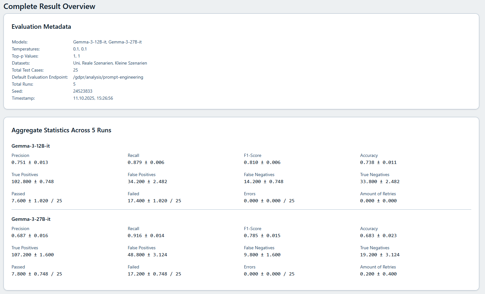
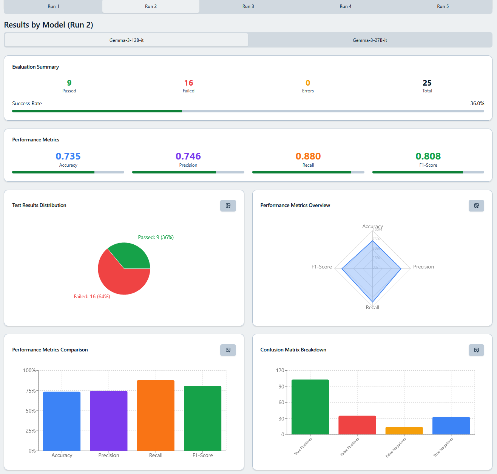
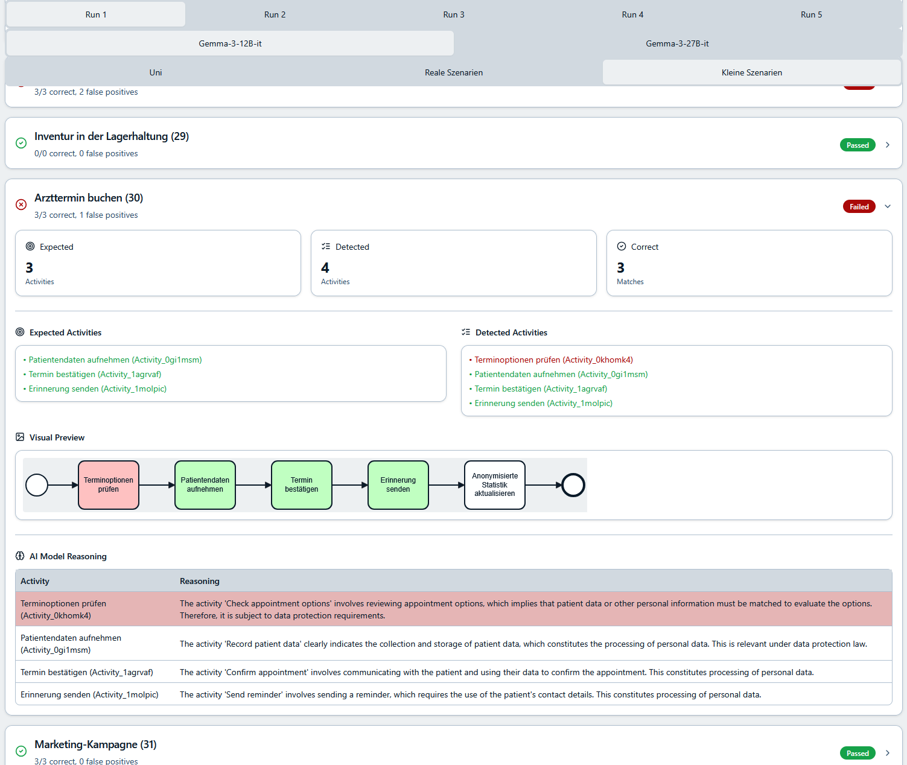
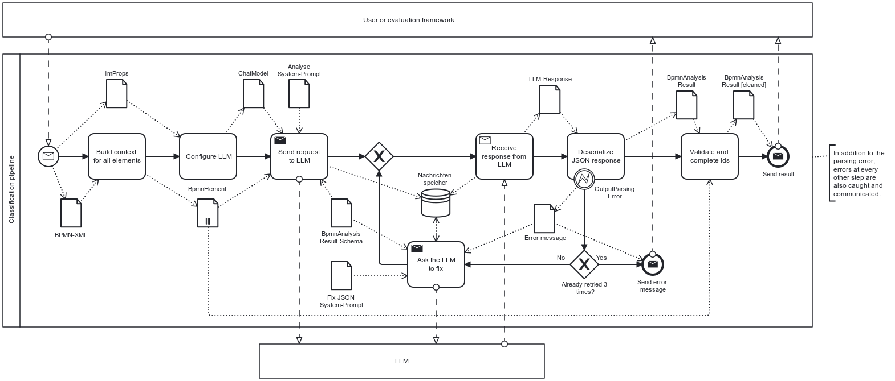

<div align="center">
  <h1>GRIPL</h1>
  <p>Identify GDPR-critical activities in BPMN business processes using LLMs</p>

  <a href="https://gripl.merten.tech"></a>
  <a href="https://github.com/MertenD/gripl-master-thesis"></a>
</div>

---

## About

GRIPL is the software artefact of a master's thesis on the automated identification of GDPR-critical activities in BPMN business process models using Large Language Models. The project provides three integrated tools:

1. **Classification Pipeline** — a prompt-engineered LLM pipeline that takes a BPMN file and classifies each activity as GDPR-critical or not, exposed via a standardised HTTP API compatible with any OpenAI-compatible LLM.
2. **Sandbox** — an interactive web app where you can model or upload BPMN diagrams and run the classification directly in the browser; critical activities are highlighted in the diagram and the LLM's reasoning is shown per element.
3. **Labeling Tool + Evaluation Framework** — a full dataset management and multi-model evaluation system: label test cases with ground truth, configure which LLMs and datasets to evaluate, and get detailed metrics (Accuracy, Precision, Recall, F1, confusion matrix) down to individual test cases.

---

## Screenshots

<table>
  <tr>
    <td><strong>Sandbox — Analyzed Process</strong><br/></td>
    <td><strong>Sandbox — LLM Reasoning</strong><br/></td>
  </tr>
  <tr>
    <td><strong>Labeling Editor</strong><br/></td>
    <td><strong>Dataset Overview</strong><br/></td>
  </tr>
  <tr>
    <td><strong>Evaluation Config</strong><br/></td>
    <td><strong>Evaluation Results Overview</strong><br/></td>
  </tr>
  <tr>
    <td><strong>Results per Model</strong><br/></td>
    <td><strong>Results per Test Case</strong><br/></td>
  </tr>
</table>

---

## Features

### Classification Pipeline

Binary, per-activity classification of BPMN 2.0 process models. Compatible with any OpenAI-compatible LLM endpoint (local models, OpenRouter, OpenAI API).

**Preprocessing** — The BPMN XML is parsed with the Camunda BPMN Model API into one `BpmnElement` per flow element, enriched with graph context: predecessors/successors, data associations, message flows, and pool/lane membership. This structured representation replaces raw XML in the prompt, keeping token count low while giving the LLM full process context.

**Prompt Engineering (Zero-Shot)** — A LangChain4j AI Service sends the element list as the user prompt against a system prompt that embeds GDPR Art. 4 definitions, positive criticality indicators (data collection, record creation, third-party transmission, payments, …), and explicit negative examples (logistical steps, anonymised data). The JSON response schema is injected automatically and enforced via `response_format` on LLMs that support it.

**Output Validation & Repair** — Three hardening steps clean the raw LLM output:
- **Schema retry** — on parse failure, the request is re-sent with the error message up to 3× before the test case is marked as failed
- **`isRelevant` filtering** — elements flagged `false` are dropped, catching cases where the LLM lists an activity but its own reasoning says it is not critical
- **ID completion** — truncated or hallucinated IDs are healed via prefix-match then substring-match against the preprocessed element list; unresolvable IDs are discarded

**Classification pipeline diagram:**



### Sandbox

An interactive web app built on [bpmn.js](https://bpmn.io/toolkit/bpmn-js/) that lets you model, import, and export BPMN diagrams and run the classification pipeline against them.

- Full BPMN editor (create, import, export `.bpmn` files)
- Configure LLM endpoint, model name, API key, temperature, topP, seed at runtime
- Critical activities highlighted directly in the diagram after analysis
- Collapsible reasoning panel showing the LLM's explanation per activity
- Download results as JSON

### Labeling Tool

A dataset management app for creating and annotating BPMN test cases to build ground-truth datasets.

- Create and manage multiple named datasets
- Import BPMN files and annotate activities as GDPR-critical in a dedicated labeling mode
- Optional natural-language justification per label for documentation
- Visual highlighting of labeled activities directly in the editor

### Evaluation Framework

A reproducible multi-model evaluation system for comparing LLMs on the labeling datasets.

- Configure runs via interactive form or YAML file (importable/exportable)
- Evaluate multiple models in parallel with configurable concurrency and repetitions
- Live streaming results from backend to frontend during the run
- Metrics: Accuracy, Precision, Recall, F1, confusion matrix (TP/FP/TN/FN)
- Drill down from overall summary → per-run → per-model → per-test-case
- Visual BPMN overlay per test case showing correct, false-positive, and false-negative classifications
- Export/import JSON reports to archive and reload results without re-running

---

## Tech Stack

<div align="center">
  <br/>
</div>

<br/>

| Layer | Choice |
|---|---|
| Frontend | Next.js 15 (App Router), TypeScript, Tailwind CSS, Radix UI / shadcn/ui |
| BPMN | bpmn.js (editor + rendering), Camunda BPMN Model API (parsing) |
| Charts | Recharts, ApexCharts |
| Backend | Spring Boot 3, Kotlin, WebFlux (reactive) |
| LLM Integration | LangChain4j with OpenAI-compatible client |
| Database | PostgreSQL 15, Flyway migrations |
| Infra | Docker, Traefik, pgAdmin 4, Watchtower |

---

## Getting Started

### Prerequisites

- Node.js 20+
- Docker + Docker Compose (for the full stack)
- A running PostgreSQL instance (or use the included Docker Compose service)
- An OpenAI-compatible LLM API key (e.g. [OpenRouter](https://openrouter.ai))

### Local development

```bash
# Frontend
cd gripl/gripl-frontend
npm install
npm run dev           # http://localhost:3000

# Backend — requires PostgreSQL
cd gripl/gripl-backend
cp .env.example .env  # fill in DB connection + LLM API key
./mvnw spring-boot:run
```

The backend starts on `http://localhost:8080`. The frontend rewrites `/api/*` → `http://localhost:8080/*` automatically.

### Docker (full stack, local)

Use `docker-compose.local.yaml` — this variant defines its own bridge network and exposes all services on localhost ports. No Traefik required.

```bash
cp .env.local.example .env   # pre-filled with local defaults; DB credentials are reused for the backend automatically

docker compose -f docker-compose.local.yaml build
docker compose -f docker-compose.local.yaml up -d
```

| Service | URL |
|---|---|
| Frontend | `http://localhost:3000` |
| Backend API | `http://localhost:8080` |
| API Docs | `http://localhost:8080/api-docs` |
| pgAdmin | `http://localhost:5050` |
| PostgreSQL | `localhost:5432` |

> `PGADMIN_BASIC_AUTH` is not required locally — pgAdmin is accessible without HTTP basic auth.

### CLI usage

The backend can also be used standalone via CLI without starting the web server:

```bash
# Analyse a single BPMN file
./mvnw spring-boot:run -Dspring-boot.run.arguments="analysis ./diagram.bpmn"

# Analyse with a custom LLM endpoint
./mvnw spring-boot:run -Dspring-boot.run.arguments="analysis ./diagram.bpmn \
  --llm.base-url=https://openrouter.ai/api/v1 \
  --llm.model-name=mistralai/mistral-medium-3.1 \
  --llm.api-key=sk-..."

# Run evaluation against the database datasets
./mvnw spring-boot:run -Dspring-boot.run.arguments="evaluation"
```

Output formats: `pretty` (default) or `json` via `--outputFormat`.

---

## Environment Variables

### Root `.env` (PostgreSQL + pgAdmin)

| Variable | Required | Description |
|---|---|---|
| `POSTGRES_DB` | ✅ | PostgreSQL database name |
| `POSTGRES_USER` | ✅ | PostgreSQL user |
| `POSTGRES_PASSWORD` | ✅ | PostgreSQL password |
| `PGADMIN_DEFAULT_EMAIL` | ✅ | pgAdmin login email |
| `PGADMIN_DEFAULT_PASSWORD` | ✅ | pgAdmin login password |
| `PGADMIN_BASIC_AUTH` | ✅ (prod) | Traefik BasicAuth hash for pgAdmin — see below |

### `gripl/gripl-backend/.env`

| Variable | Required | Description |
|---|---|---|
| `SPRING_DATASOURCE_URL` | ✅ | PostgreSQL JDBC URL, e.g. `jdbc:postgresql://gripl-postgres:5432/gripl` |
| `SPRING_DATASOURCE_USERNAME` | ✅ | Database user |
| `SPRING_DATASOURCE_PASSWORD` | ✅ | Database password |

> **No server-side API key is configured.** LLM API keys must be provided by the user in the app UI (sandbox or evaluation config). They are saved in the browser's sessionStorage (cleared when the tab is closed) and resolved client-side before any request is sent. If you run the app privately and want to pre-configure a key, set `llm.api-key=sk-...` in `application.properties` — the backend still resolves `${OPENAI_API_KEY}` and `${OPEN_ROUTER_API_KEY}` placeholders from environment variables as a fallback.

---

## Docker & Traefik Deployment

The `docker-compose.yaml` is designed for a server running Traefik with the `le-merten` TLS certificate resolver and an external `web` Docker network.

### 1. Create `.env` files

```bash
cp .env.example .env
cp gripl/gripl-backend/.env.example gripl/gripl-backend/.env
# Fill in production values
```

### 2. Generate the pgAdmin basic-auth password

```bash
# Requires apache2-utils, or use Docker:
docker run --rm httpd htpasswd -nB admin

# Escape $ signs for docker-compose interpolation:
htpasswd -nB admin | sed 's/\$/\$\$/g'
```

Paste the result as `PGADMIN_BASIC_AUTH` in `.env`.

### 3. Build and start

```bash
docker compose build
docker compose up -d
```

The app will be live at `https://gripl.merten.tech`. pgAdmin is accessible at `https://pgadmin.gripl.merten.tech` and is protected by HTTP basic auth.

### Services

| Service | URL | Notes |
|---|---|---|
| Frontend | `https://gripl.merten.tech` | Next.js app |
| Backend API | `https://gripl.merten.tech/api/` | Spring Boot; `/api/` prefix is stripped by Traefik |
| API Docs | `https://gripl.merten.tech/api-docs` | Swagger UI |
| pgAdmin | `https://pgadmin.gripl.merten.tech` | Protected by BasicAuth |

---

## Evaluation Config (YAML)

Evaluations can be configured declaratively with a YAML file, importable in the UI or passable via CLI:

```yaml
defaultEvaluationEndpoint: /gdpr/analysis/prompt-engineering
maxConcurrent: 10
repetitions: 3
seed: 42
models:
  - label: Mistral Medium 3.1
    llmProps:
      baseUrl: https://openrouter.ai/api/v1
      modelName: mistralai/mistral-medium-3.1
      apiKey: ${OPEN_ROUTER_API_KEY}
  - label: GPT-4o
    llmProps:
      baseUrl: https://api.openai.com/v1
      modelName: gpt-4o
      apiKey: ${OPENAI_API_KEY}
datasets:
  - 1
  - 2
```

API keys can be referenced as placeholders (`${OPENAI_API_KEY}`, `${OPEN_ROUTER_API_KEY}`). When you import this YAML into the UI, the placeholders stay as-is in the model rows. The frontend resolves them at submit time using the values you entered in the **API Keys** section of the evaluation config page — nothing is stored in the YAML file itself.

---

## Repository Structure

```
gripl-master-thesis/
├── docker-compose.yaml          # Production deployment (Traefik + external web network)
├── docker-compose.local.yaml    # Local development (bridge network, localhost ports)
├── gripl/
│   ├── gripl-frontend/          # Next.js web app (sandbox + labeling + evaluation UI)
│   └── gripl-backend/           # Spring Boot API (classification + evaluation engine)
├── experiments/                 # Saved experiment configs and result JSON reports
└── thesis/                      # LaTeX master's thesis source + images
```
